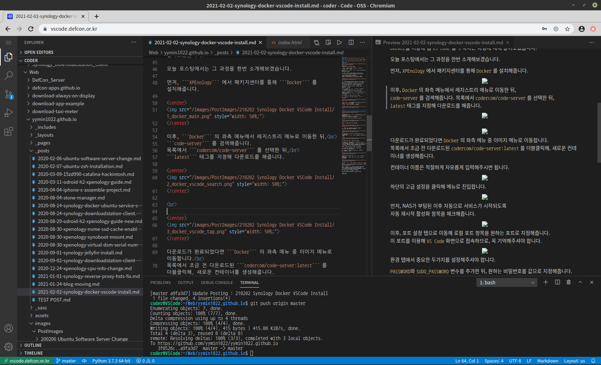

# H1 ASDFQWER

## H2 ASDFQWER
### H3 ASDFQWER
#### H4 ASDFQWER
##### H5 ASDFQWER
###### H6 ASDFQWER

Normal Text ASDFQWER

Bold **ASDFQWER**

Cancellation ~ASDFQWER~

Italic *ASDFQWER*

1. ASDFQWER

ASDFQWER

2. ASDFQWER
3. ASDFQWER

> ASDFQWER

```ASDFQWER```

https://dev-lr.com/

[Dev. LR](https://dev-lr.com/)



```md
ASDFQWER
#H1
##H2
```

```python
print("Hello World")
```

```c
printf("Hello World");
```
